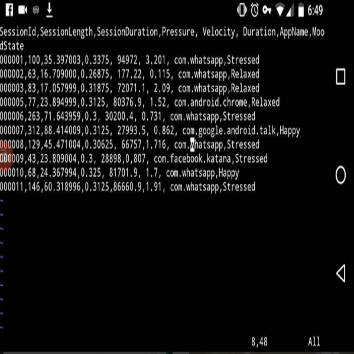
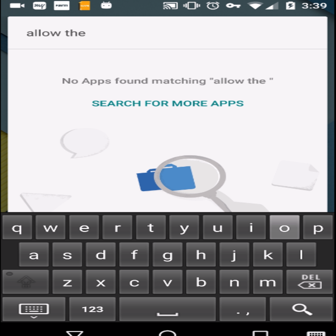
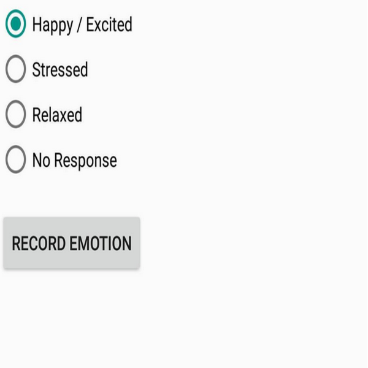

  
  
  
  <video width="320" height="240" controls>
	<source src="../images/affectsense/project_2.mp4" type="video/mp4">
	Your Browser does not support video tag
	</video>

The AffectSense keyboard is developed in order to be able to store various swipe features while user uses the keyboard for typing. These features includes swipe velocity, pressure, distance upto or length of swipe. Along with it the application on which user is typing is stored and for every new application used an average of the feature is calculated for 30 min time window.

Initially our project focused on study of the effect of users mood to swipe on mobile screen. Then because of Google's new patent law for gesture typing, the access to swipe api was restricted. Thus we needed to develop a keyboard on the first place that can allow gesture typing and store swipe feature. We started with study of latinIME and various android source code available Google AOSP. We then worked out on an algorithm that genrates a regular expression according to the pause user takes while making a direction change. This regular expression currently contains only three most repeated letter (where the pause was long as compared to other letters) and longest matching string from the dictionary was retrieved.

You can learn more at the [AffectSense Github Source](https://www.github.com/abhishekcs10/AffectSense).

